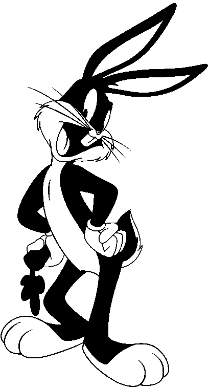
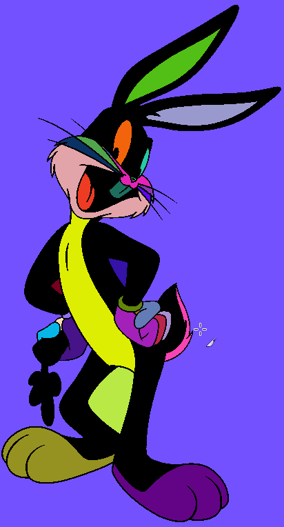

# Coloriage d'images

## Principe

Le but de ce projet est de prendre une image en noir et blanc et de la colorier automatiquement en utilisant des algorithmes de traitement d'image.

## Compétences acquises

Le projet de développement "Coloriage d'images" a été réalisé dans le cadre du cours de Structure de Données et Algorithmes 2 en deuxième année de licence en Informatique. L'objectif du projet était d'implémenter un algorithme de coloriage automatique d'une image en noir et blanc.

Le travail à rendre pour ce projet consistait en un document synthétique de maximum six pages, un fichier Makefile ainsi que les fichiers source commentés en langage C. De plus, des jeux de tests comprenant des programmes de tests et les fichiers d'images utilisés pour les tests devaient également être fournis. Le code devait respecter les conventions d'écriture du langage C, être bien commenté et lisible. Des outils tels que gdb, valgrind ou gprof pouvaient être utilisés pour faciliter le développement et optimiser le programme.

Le problème abordé dans ce projet était le coloriage automatique d'une image en noir et blanc. L'objectif était de regrouper tous les pixels blancs en régions connexes et de leur attribuer une couleur aléatoire. Pour cela, un nouveau tableau bi-dimensionnel était généré, de même taille que l'image d'origine, où les pixels noirs restaient inchangés et les pixels blancs étaient coloriés.

L'approche proposée pour résoudre ce problème était l'utilisation d'une structure de données appelée "ensembles disjoints" (disjoint-set data structure). Cette structure permet de gérer des ensembles dynamiques disjoints, où chaque ensemble est identifié par un représentant. Trois opérations principales étaient utilisées : MakeSet(x), FindSet(x) et Union(x,y). Dans le contexte de ce projet, les ensembles représentaient des ensembles de pixels.

Deux structures de données différentes ont été utilisées pour implémenter les ensembles dans cet algorithme de coloriage. La première était une liste chaînée améliorée, où chaque objet de la liste contenait une information de pixel, un pointeur vers l'objet suivant et un pointeur vers le représentant de l'ensemble. La deuxième structure était un arbre, où chaque nœud de l'arbre contenait une information de pixel, un pointeur vers son nœud parent et un rang utilisé pour optimiser l'opération Union.

Le projet comprenait également des tests de performance et de validité, utilisant des images au format PBM (Portable Bitmap File Format) ASCII. Les images d'entrée étaient en noir et blanc, et les images résultantes étaient au format PPM (Portable Pixmap File Format) ASCII, avec des couleurs attribuées aux régions connexes.

Ce projet a permis d'approfondir la compréhension des structures de données et des algorithmes, ainsi que de mettre en pratique les connaissances acquises lors du cours de Structure de Données et Algorithmes 2. Il a également permis de développer des compétences en programmation en langage C et en gestion de projets de développement.

### Exemple : Coloriage de Bugs Bunny

## Compilation

Avant la première compilation faire :
	- make install
  	 - make
	- ./bin/projet `<mode>` <fichier_type>
	`<mode>` : liste | arbre
	<fichier_type> : 1 pour un fichier généré, 2 pour un fichier déjà existant
